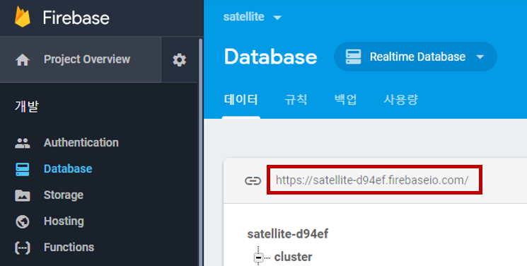

READ ME
========
# 구조
Producer.py가 카프카 통신을 통해 특정 메시지를 전송하면 RsyncConsumer.py가 kafka consumer를 사용해서 rsync를 실행시켜서 사용자가 지정한 src 디렉토리의 파일을 dst 디렉토리로 복사합니다. 

# RsyncConsumer.py
value값이 'Execute Rsync'이 메시지를 받으면 Rsync를 실행시키도록 구성이 되어 있습니다.
기본적으로 반복분 poll 구조이기 때문에 실행시켜놓으면 사용자가 직접 종료하기 전까진 메시지가 들어올 때마다 작동합니다.

# 실행 방법

RysncConsumer.py 내 Firebase RealTime Database URL 입력

    $ python RysncConsumer.py {토픽} {아이피주소:포트} {아이피주소:포트} {아이피주소:포트} ...

    ex)
    $ python RysncConsumer.py topic 127.0.0.1:9092 127.0.0.2:9092 127.0.0.3:9092 