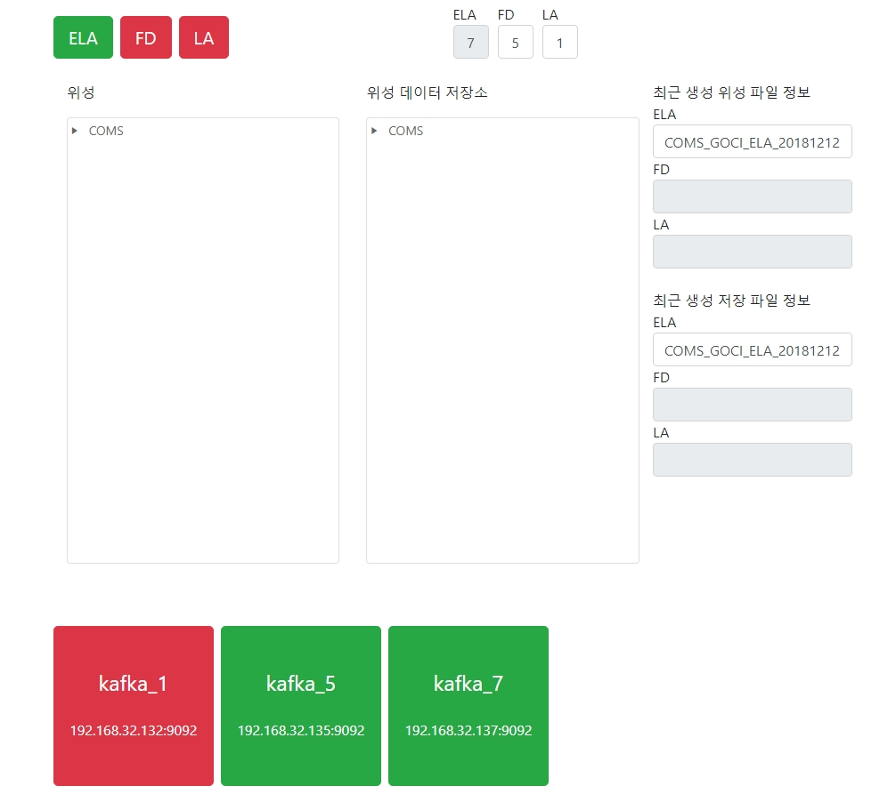

# 위성 산출물 송수신 서버 테스트 모듈

## 서비스 구성

### 위성 산출물 관리 페이지 

<sub>[UI 기능 설명](./SatelliteBackup)</sub>



### 위성 산출물 서버 동작 Flow


<br>

## 시작하기

### 필요한 서버

- 모의 인공위성 실행 서버 1개(위성 산출물 생성용)
- Kafka 서버 N개(Cluster의 개수만큼 필요)
- Kafka 서버 모니터링 서버 1개(Kafka Cluster 모니터링용)
- 위성 산출물 저장용 서버 1개(위성 산출물 수신용)
- 위성 산출물 관리 페이지용 서버 1개
- 실시간 정보 반영을 위한 Firebase 서버 1개

### 관련 모듈 설치

    $ pip install -r requirements.txt

### 모의 인공위성 실행(①)
    
[Mockup_Satellite 참고](Mockup_Satellite)
    

### 실행 방법

    $ pip install -r requirements.txt
    $ python satellite_start.py {아이피주소:포트} {토픽}
    
    ex)
    $ python main.py 127.0.0.1:9092 topic
    
    
RestFul

    request
        http://localhost:5002/start/<mode>/<interval>
        http://localhost:5002/stop/<mode>/
       
    response
        success: 'OK'
    
### Kafka Server Docker 실행(②)

[Kafka_Docker 참고](./Kafka_Docker)
    
    1. git clone kafka-docker (https://github.com/wurstmeister/kafka-docker.git)
    2. docker-compose.yml 파일 수정 (ip 주소는 해당 호스트의 ip 주소로 설정)
    3. docker-compose 실행
    
    ```
    $ docker-compose up -d (or -f)
    ```
    
    * zookeeper 설정: https://stackoverflow.com/questions/48789422/apache-kafka-cluster-not-conne

### Kafka Server Monitor 실행(③)

[Kafka_Monitor 참고](./Kafka_Monitor)

    $ python kafka_monitor_start.py {서버 이름} {아이피:포트} {서버 이름} {아이피:포트} ...
    
    ex)
    $ python kafka_monitor_start.py kafka1 192.168.32.132:9092 kafka2 192.168.32.135:9092 kafka3 192.168.32.137:9092

### Rsync Producer 실행(④)

[Kafka_Consumer_Saver 참고](Kafka_Consumer_Saver)

    $ python RysncConsumer.py {아이피주소:포트} {토픽}

    ex)
    $ python RysncConsumer.py 127.0.0.1:9092 topic

### 위성 산출물 관리 페이지 실행

[SatelliteBackup 참고](SatelliteBackup)

    $ npm install
    $ npm start

브라우저를 사용해 지정한 포트번호로 접속(기본 포트번호는 localhost:4200)
