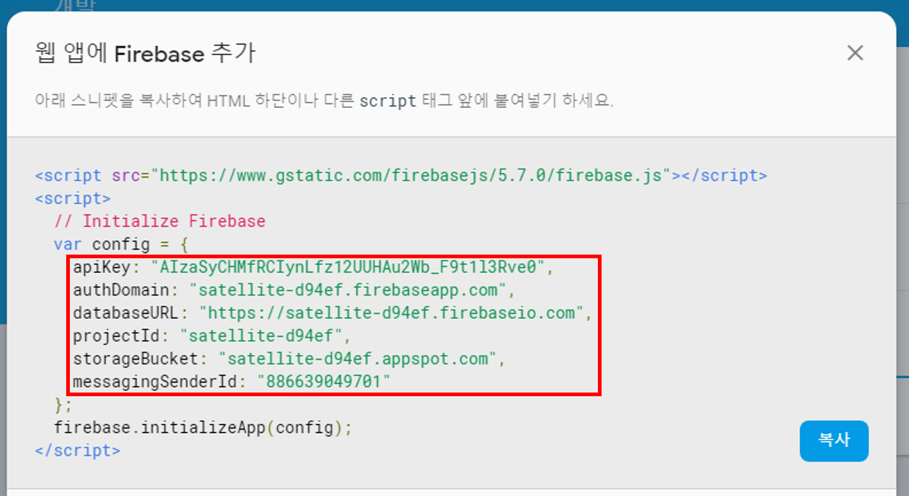
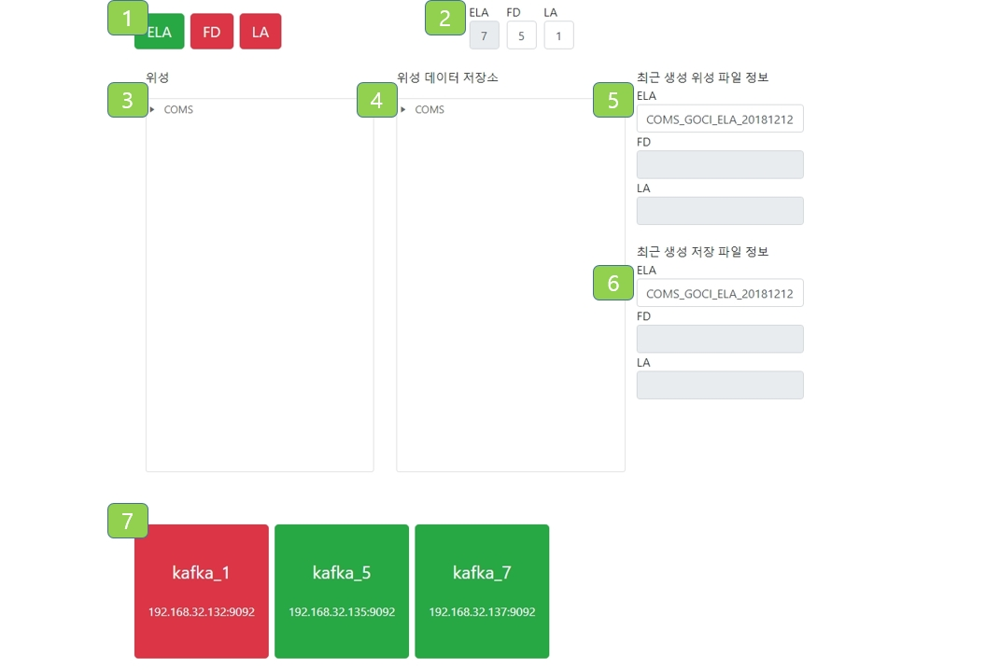

## 프론트 앤드 설치 및 실행
### 1. pakage.json의 모듈 설치

    $ npm install

### 2. Firebase config 설정
- envirionment/envirionment.ts에 firebase config 추가
- envirionment/envirionment.prod.ts firebase config 추가  

  
```
export const environment = {
  ...
  firebase: {
    apiKey: {my-apiKey},
    authDomain: {my-authDomain},
    databaseURL: {my-databaseURL},
    projectId: {my-projectId},
    storageBucket: {my-storageBucket},
    messagingSenderId: {my-messagingSenderId}
  }
  ...
};
```


### 3. 서버 실행

    $ ng serve --host 0.0.0.0 --open

### 4. 브라우저에서 해당 호스트의 ip로 접속 (기본 포트: 4200)  
    ex) http://192.168.100.67:4200

&nbsp;  

## UI기능



### 촬영모드 선택(①)
  1. 버튼을 클릭하는 것으로 각 촬영모드를 활성화/비활성화 할 수 있다.
  2. 특정 촬영모드를 활성화할 경우 촬영 주기 설정(②)에 설정된 주기로 실행된다.

### 촬영주기 설정(②)
  1. 숫자를 입력하는 것으로 각 촬영모드의 촬영주기를 설정할 수 있다.
  2. 촬영 모드 선택(①)에서 특정 촬영모드가 실행될 경우 해당 촬영모드의 촬영주기는 비활성화되어 값을 변경할 수 없다.

### 데이터 조회(③,④)
  1. 위성 및 위성 데이터 저장소에 저장된 데이터를 조회할 수 있다.
  2. 디렉토리 탐색기를 통해 디렉토리 구조와 저장된 데이터를 확인할 수 있으며 현재 디렉토리 경로는 탐색기의 상단에 나타난다.

### 최근 생성 파일 정보 확인(⑤,⑥)
  1. 가장 최근에 생성된 위성 파일 및 저장 파일을 확인할 수 있다.
  2. 촬영모드 선택(①)에서 활성화된 촬영모드의 생성파일만 확인할 수 있다. 나머지 촬영모드의 최근 저장 파일은 비활성화 된다.

### 서버 상태 확인(⑦)
  1. 현재 서버의 상태를 확인할 수 있다.
  2. 각 서버는 해당 서버의 이름과 주소를 가진 박스형태로 보여진다.
  3. 박스의 색상은 해당 서버의 연결이 정상적일때는 초록색, 연결이 끊겼을 경우에는 빨간색으로 표현된다.
